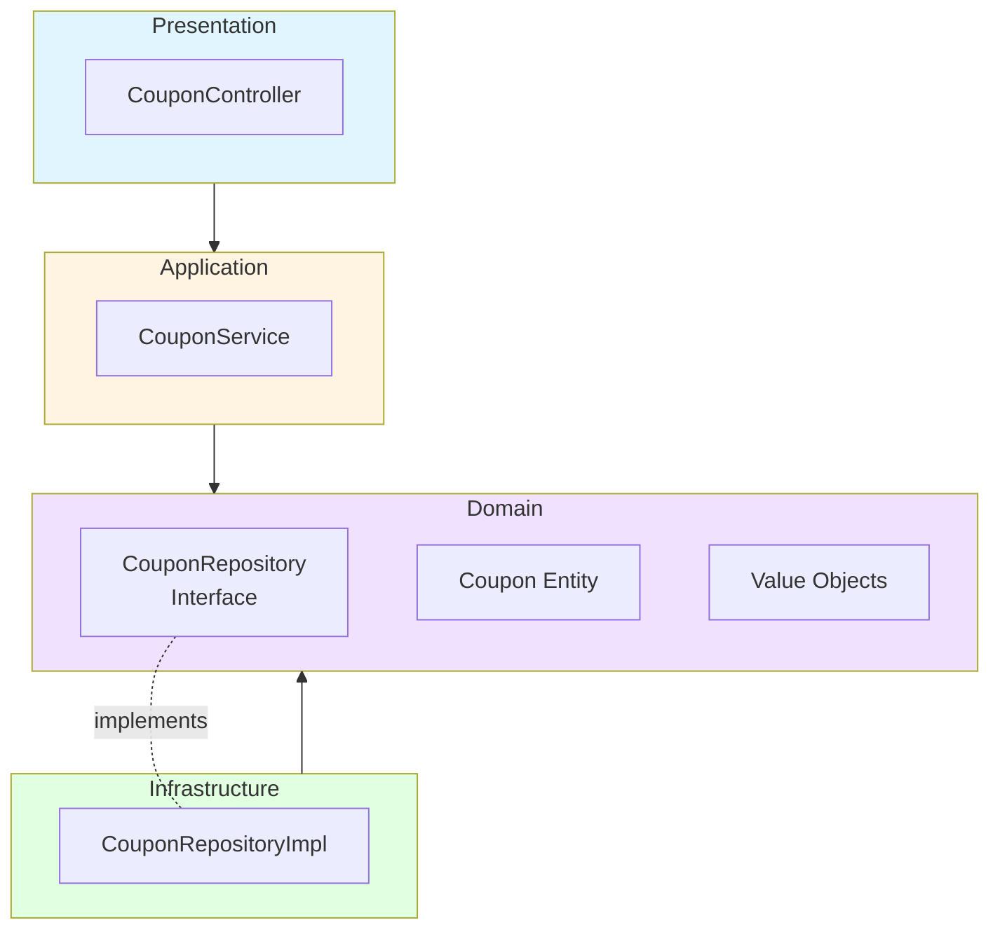
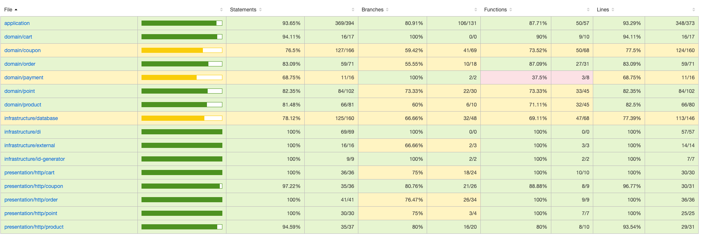

## 레이어 구성(Coupon) - Step 5



## 테스트 커버리지 - Step5



- 전체 파일 기준
  - statement: 88.05%
  - branch: 72.92%
  - function: 78.01%
  - line: 87.7%

## 동시성 문제 해결 방안 - Step6

### Mutex 활용 (async Mutex)

```typescript
import { Mutex } from 'async-mutex';
// ... 생략

@Injectable()
export class CouponService {
  private readonly couponMutexes = new Map<string, Mutex>();
  // ... 생략

  async issueCoupon(couponId: string, userId: string, issuedAt: Date = new Date()): Promise<UserCoupon> {
    const mutex = this.getCouponMutex(couponId);
    const release = await mutex.acquire();

    try {
      // 비즈니스 로직
    } finally {
      release();
    }
  }
}
```

- JavaScript는 싱글 스레드임에도 비동기 작업에서 동시성 문제 발생 가능
- async-mutex를 활용하여 임계영역 확보, 메모리적 동시성 해결

### 테스트

```typescript
describe('쿠폰 발급 동시성 제어', () => {
  it('여러 사용자가 동시에 한정 쿠폰을 발급받으면 정확히 발급 수량만큼만 발급된다', async () => {
    // given: 수량이 1개인 쿠폰 생성
    const limitedCoupon = new Coupon(
      'coupon-limited-concurrent',
      '한정 동시성 테스트 쿠폰',
      new DiscountValue(DiscountType.FIXED, 5000),
      null,
      new Point(20000),
      new CouponQuantity(1, 0),
      new ValidityPeriod(new Date('2025-01-01'), new Date('2025-12-31')),
      new Date('2025-01-01'),
    );
    await couponRepository.saveCoupon(limitedCoupon);

    const users = ['user-concurrent-1', 'user-concurrent-2', 'user-concurrent-3'];

    // when: 3명의 사용자가 동시에 쿠폰 발급 시도
    const results = await Promise.allSettled(
      users.map((userId) => couponService.issueCoupon(limitedCoupon.getId(), userId)),
    );

    // then: 1명만 성공, 2명은 실패
    const successCount = results.filter((r) => r.status === 'fulfilled').length;
    const failureCount = results.filter((r) => r.status === 'rejected').length;

    expect(successCount).toBe(1);
    expect(failureCount).toBe(2);

    // 쿠폰 재고 확인
    const updatedCoupon = await couponRepository.findCouponById(limitedCoupon.getId());
    expect(updatedCoupon?.getQuantity().getIssuedQuantity()).toBe(1);
    expect(updatedCoupon?.getQuantity().canIssue()).toBe(false);
  });
});
```

```bash
쿠폰 발급 동시성 제어
    ✓ 여러 사용자가 동시에 한정 쿠폰을 발급받으면 정확히 발급 수량만큼만 발급된다 (85 ms)
```

## 인기 상품 조회 효율적으로 구현하기 - Step6

### 집계 테이블 활용


- 랭킹 집계를 위해 매번 조회 테이블 스캔하는 것은 DB에 많은 부하를 가함
- 매일 새벽 배치를 통해 사전 집계하여 랭킹 테이블에 저장

```typescript
@Cron(CronExpression.EVERY_DAY_AT_MIDNIGHT)
async calculate3DayRankings() {
    this.logger.log('최근 3일 인기 상품 랭킹 계산 시작');

    try {
        const rankings = await this.productRankingService.calculateRankings(3);
        this.logger.log(`최근 3일 랭킹 계산 완료: ${rankings.length}개 상품`);
    } catch (error) {
        this.logger.error('최근 3일 랭킹 계산 실패', error);
    }
}
```
