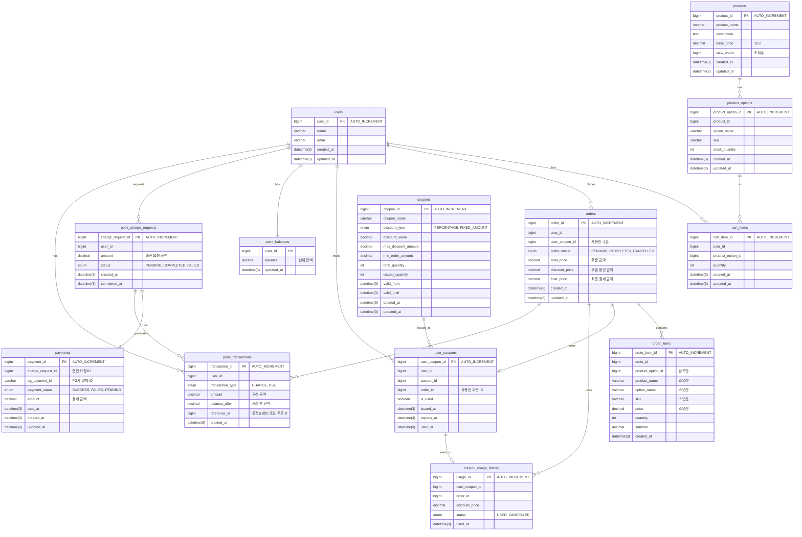

# 패션 커머스 시스템 - ERD 설계

## PK 전략: BIGINT AUTO_INCREMENT

모든 테이블의 PK는 BIGINT AUTO_INCREMENT 사용

### 선택 이유

- **단순성**: MySQL의 표준 AUTO_INCREMENT 사용으로 설정 및 관리 간소화
- **성능**: 순차적 ID 생성으로 인덱스 효율성 향상
- **충분한 범위**: BIGINT로 최대 9,223,372,036,854,775,807까지 표현 가능

## 스냅샷 OrderItem

### 스냅샷을 선택한 이유

```sql
-- 문제 상황: 상품 정보가 변경되면 과거 주문 내역도 영향을 받음
-- 2024년 1월: 상품 가격 29,000원으로 주문
-- 2024년 2월: 상품 가격 39,000원으로 인상
-- 결과: 1월 주문 내역도 39,000원으로 보이는 문제 발생

-- 해결: 주문 시점의 정보를 order_items에 저장 (스냅샷)
```

### 스냅샷 컬럼

- `product_name`: 상품명 (상품명 변경되어도 주문 내역 유지)
- `option_name`: 옵션명 (옵션 변경되어도 무관)
- `sku`: SKU 코드
- `price`: 단가 (가격 변경되어도 주문 시점 가격 유지)
- `quantity`: 수량
- `subtotal`: 소계 (계산 결과 저장)

## 포인트 결제 시스템

### 요구 사항

본 시스템은 **포인트만으로 결제**하는 구조입니다.

- **주문 결제**: 포인트로만 결제 (외부 PG 연동 없음)
- **포인트 충전**: 외부 PG(Mock)를 통해 결제 후 포인트 충전
- **Payment 테이블 용도**: 포인트 충전을 위한 PG 결제 정보 저장

### 포인트 충전 플로우

1. 사용자가 충전 요청 생성 (`point_charge_requests` - PENDING)
2. 클라이언트가 Mock PG로 결제 진행
3. PG 결제 완료 (`payments` 레코드 생성)
4. 서버에서 PG 결제 검증 후 포인트 충전
5. 포인트 잔액 업데이트 (`point_balances`)
6. 충전 거래 내역 생성 (`point_transactions` - CHARGE)
7. 충전 요청 완료 처리 (`point_charge_requests` - COMPLETED)

### 주문 결제 플로우

1. 주문 생성 시 포인트 잔액 확인
2. 최종 금액만큼 포인트 차감 (`point_balances`)
3. 사용 거래 내역 생성 (`point_transactions` - USE)
4. 주문 완료 처리

## ERD 다이어그램



## 제약 조건 정책

### 데이터베이스 레벨 제약 없음

현재 스키마는 **최소한의 제약 조건**만 유지합니다:

- **PRIMARY KEY만 존재**: 각 테이블의 PK만 정의
- **외래키 없음**: 락 전파 문제 방지를 위해 DB 레벨 FK 제약 없음
- **인덱스 없음**: 성능 최적화는 필요 시 추가
- **NOT NULL 없음**: 애플리케이션 레벨에서 검증
- **DEFAULT 없음**: 애플리케이션 레벨에서 설정
- **ON UPDATE 트리거 없음**: 명시적 업데이트만 허용

### 설계 철학

1. **애플리케이션 레벨 제어**: 모든 비즈니스 로직과 제약은 애플리케이션에서 관리
2. **동시성 제어**: DB 락 전파 방지로 높은 동시성 확보
3. **유연성**: 스키마 변경 최소화, 빠른 마이그레이션 가능
4. **명시성**: 암묵적 동작(trigger, cascade) 없이 명시적 코드로 관리
