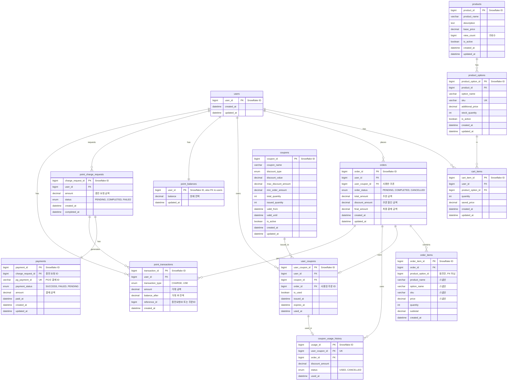

# 패션 커머스 시스템 - ERD 설계

## PK 전략 Snowflake ID

모든 테이블의 PK는 Snowflake ID (BIGINT) 사용

### 선택 이유

- **현재**: 모놀리식 구조이지만 향후 MSA 확장 가능성 고려
- **분산 환경 대비**: 서비스 분리 시 ID 충돌 없이 독립적 생성 가능

## 스냅샷 OrderItem

### 스냅샷을 선택한 이유

```sql
-- 문제 상황: 상품 정보가 변경되면 과거 주문 내역도 영향을 받음
-- 2024년 1월: 상품 가격 29,000원으로 주문
-- 2024년 2월: 상품 가격 39,000원으로 인상
-- 결과: 1월 주문 내역도 39,000원으로 보이는 문제 발생

-- 해결: 주문 시점의 정보를 order_items에 저장 (스냅샷)
```

### 스냅샷 컬럼

- `product_name`: 상품명 (상품명 변경되어도 주문 내역 유지)
- `option_name`: 옵션명 (옵션 변경되어도 무관)
- `sku`: SKU 코드
- `price`: 단가 (가격 변경되어도 주문 시점 가격 유지)
- `quantity`: 수량
- `subtotal`: 소계 (계산 결과 저장)

## 포인트 결제 시스템

### 요구 사항

본 시스템은 **포인트만으로 결제**하는 구조입니다.

- **주문 결제**: 포인트로만 결제 (외부 PG 연동 없음)
- **포인트 충전**: 외부 PG(Mock)를 통해 결제 후 포인트 충전
- **Payment 테이블 용도**: 포인트 충전을 위한 PG 결제 정보 저장

### 포인트 충전 플로우

1. 사용자가 충전 요청 생성 (`point_charge_requests` - PENDING)
2. 클라이언트가 Mock PG로 결제 진행
3. PG 결제 완료 (`payments` 레코드 생성)
4. 서버에서 PG 결제 검증 후 포인트 충전
5. 포인트 잔액 업데이트 (`point_balances`)
6. 충전 거래 내역 생성 (`point_transactions` - CHARGE)
7. 충전 요청 완료 처리 (`point_charge_requests` - COMPLETED)

### 주문 결제 플로우

1. 주문 생성 시 포인트 잔액 확인
2. 최종 금액만큼 포인트 차감 (`point_balances`)
3. 사용 거래 내역 생성 (`point_transactions` - USE)
4. 주문 완료 처리

## ERD 다이어그램



## 인덱스 설계

### 성능 최적화를 위한 인덱스

```sql
-- 1. 인기 상품 조회 (최근 3일, 조회수 기반)
CREATE INDEX idx_products_view_count_created
ON products(view_count DESC, created_at DESC)
WHERE is_active = true;

-- 2. 상품 옵션 조회 (상품별 옵션 목록)
CREATE INDEX idx_product_options_product_id
ON product_options(product_id)
WHERE is_active = true;

-- 3. 장바구니 조회 (사용자별)
CREATE INDEX idx_cart_items_user_id
ON cart_items(user_id);

-- 4. 주문 조회 (사용자별, 최신순)
CREATE INDEX idx_orders_user_id_created
ON orders(user_id, created_at DESC);

-- 5. 주문 아이템 조회 (주문별)
CREATE INDEX idx_order_items_order_id
ON order_items(order_id);

-- 6. 포인트 거래 내역 조회 (사용자별, 최신순)
CREATE INDEX idx_point_transactions_user_created
ON point_transactions(user_id, created_at DESC);

-- 7. 쿠폰 발급 내역 조회 (사용자별)
CREATE INDEX idx_user_coupons_user_id
ON user_coupons(user_id, is_used, expires_at);

-- 8. 쿠폰 발급 수량 체크 (동시성 제어)
CREATE INDEX idx_coupons_issued_quantity
ON coupons(coupon_id, issued_quantity, total_quantity)
WHERE is_active = true;

-- 9. 포인트 충전 요청 조회
CREATE INDEX idx_charge_requests_user_status
ON point_charge_requests(user_id, status, created_at DESC);
```
