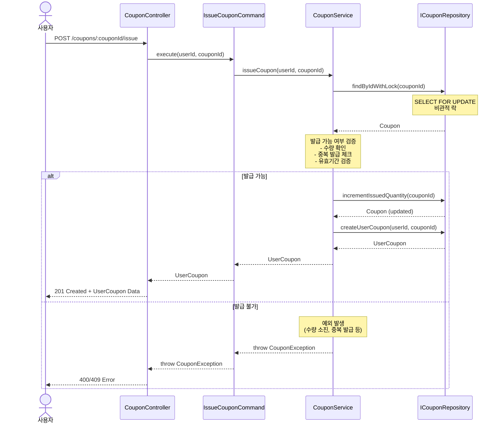
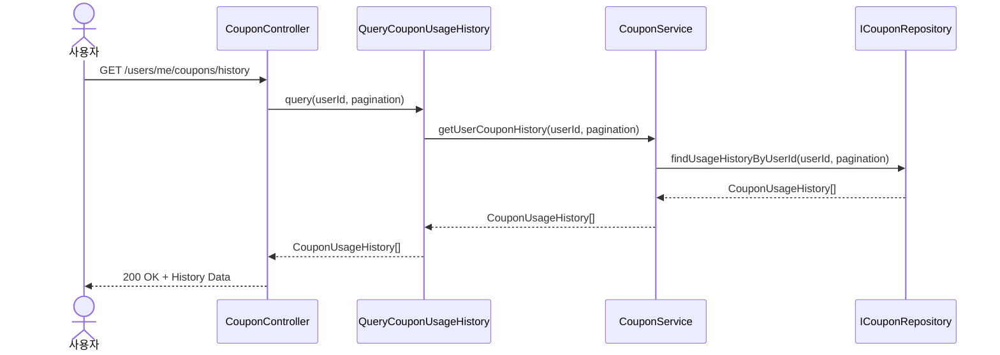

# 쿠폰 시퀀스 다이어그램

## 1. 선착순 쿠폰 발급 (POST /coupons/:couponId/issue)

## 2. 쿠폰 사용 이력 조회 (GET /users/me/coupons/history)

## 주요 특징

### 레이어 구조
- **Controller (Presentation)**: HTTP 요청/응답 처리, Domain → DTO 변환
- **UseCase (Application)**: 비즈니스 플로우 조율, 트랜잭션 경계
- **DomainService (Domain)**: 도메인 로직, 동시성 제어, 비즈니스 규칙 검증
- **Repository (Infrastructure)**: 데이터 영속성, Prisma ↔ Domain 변환

### 도메인 모델
- **Coupon**: 쿠폰 기본 정보 (할인 타입, 발급 수량 등)
- **UserCoupon**: 사용자별 발급된 쿠폰 (발급일, 사용 여부, 만료일)
- **CouponUsageHistory**: 쿠폰 사용 이력 (주문 정보, 할인 금액)

### 동시성 제어 (선착순 쿠폰 발급)
- **비관적 락 (Pessimistic Lock)** 사용
  - `SELECT ... FOR UPDATE`로 쿠폰 조회
  - 트랜잭션 커밋 전까지 다른 요청 대기
  - Race Condition 방지

- **검증 로직**
  - 발급 가능 수량: `issued_quantity < total_quantity`
  - 중복 발급 방지: 동일 사용자 & 쿠폰 조합 체크
  - 유효기간 확인: 쿠폰 유효 시작/종료일 검증

### 에러 처리

- **쿠폰 수량 소진**: 400 Bad Request (COUPON_OUT_OF_STOCK)
- **중복 발급**: 409 Conflict (COUPON_ALREADY_ISSUED)
- **존재하지 않는 쿠폰**: 404 Not Found
- **유효기간 만료**: 400 Bad Request (COUPON_EXPIRED)
- **동시성 제어 타임아웃**: 500 Internal Server Error
