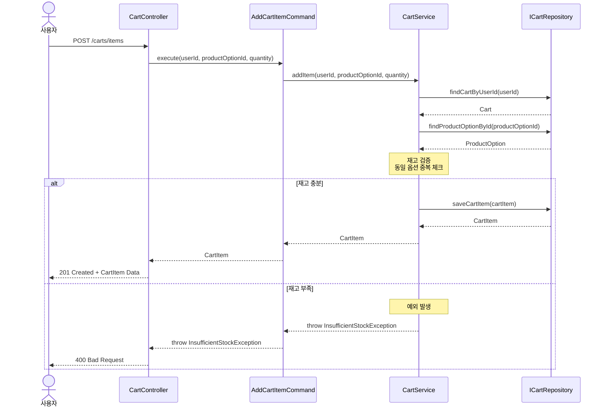
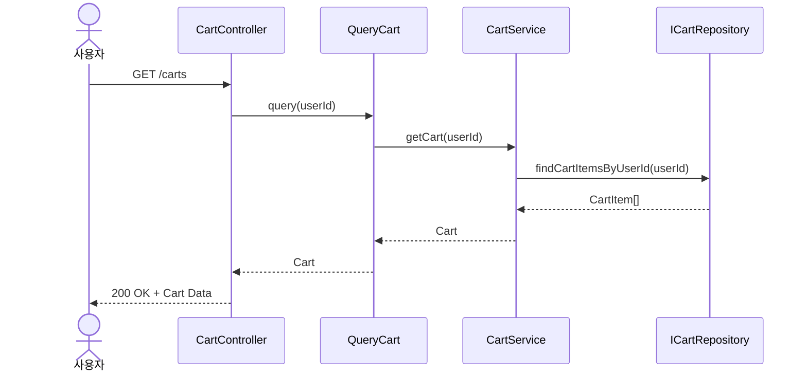
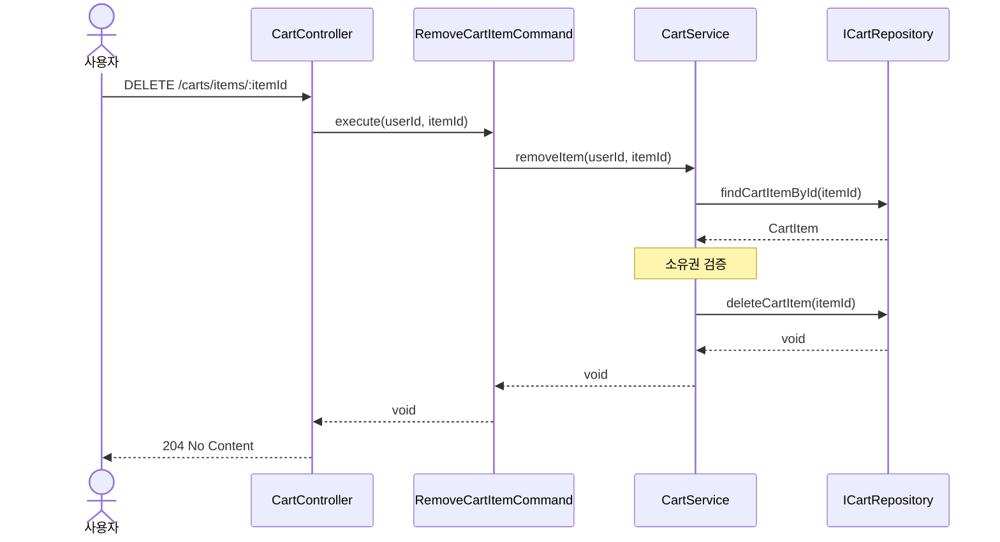
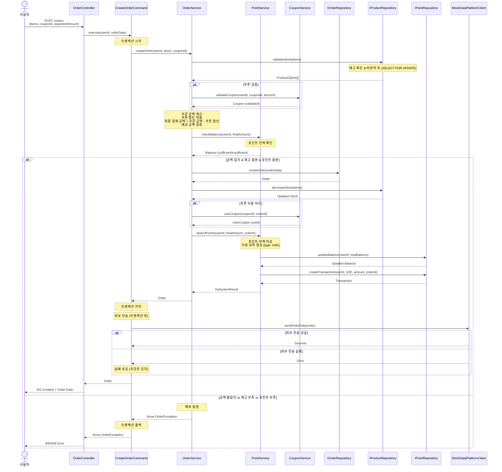

# 주문 시퀀스 다이어그램

## 1. 장바구니 상품 추가 (POST /carts/items)

## 2. 장바구니 조회 (GET /carts)

## 3. 장바구니 아이템 삭제 (DELETE /carts/items/:itemId)

## 4. 주문 생성 (POST /orders)

## 주요 특징

### 레이어 구조

- **Controller (Presentation)**: HTTP 요청/응답 처리
- **UseCase (Application)**: 비즈니스 플로우 조율, 트랜잭션 경계
- **DomainService (Domain)**: 도메인 로직, 비즈니스 규칙 검증, 도메인 간 협력
- **Repository (Infrastructure)**: 데이터 영속성

### 도메인 모델

- **Cart**: 장바구니 도메인 객체 (테이블 없음, CartItem[]로 구성, 총액 계산 로직 포함)
- **CartItem**: 장바구니 아이템 (ProductOption 참조)
- **Order**: 주문 (주문 상태, 총액 등)
- **OrderItem**: 주문 아이템 (ProductOption, 수량, 가격)
- **OrderWithItems**: Order + OrderItem[] 조합 모델
- **PointBalance**: 사용자 포인트 잔액
- **PointTransaction**: 포인트 거래 내역 (충전/사용)

### 외부 시스템 연동 (주문 데이터 전송)

- **전송 시점**: 트랜잭션 커밋 **후**
- **전송 대상**: MockDataPlatformClient (데이터 플랫폼)
- **전송 실패 처리**:
  - 주문은 이미 커밋되어 유지됨
  - 실패 로그 기록
  - 재시도 큐에 등록 (선택적)
- **트랜잭션 전파 패턴**: `REQUIRES_NEW` 또는 트랜잭션 밖에서 실행

### 동시성 제어 (재고 차감)

- **비관적 락 (Pessimistic Lock)** 사용
  - `SELECT ... FOR UPDATE`로 상품 옵션 조회
  - 재고 차감 중 다른 요청 대기
  - Race Condition 방지

### 비즈니스 규칙

- **재고 검증**: 주문 수량 ≤ 재고 수량
- **금액 검증**: 클라이언트 예상 금액 === 서버 계산 금액
- **쿠폰 검증**: 유효기간, 사용 여부, 최소 주문 금액
- **포인트 검증**: 포인트 잔액 ≥ 최종 결제 금액
- **권한 검증**: 본인 주문만 조회 가능

### 포인트 결제

- **결제 수단**: 포인트 전용 (외부 PG 연동 없음)
- **결제 금액**: 최종 결제 금액 = 주문 금액 - 쿠폰 할인
- **포인트 차감**: 주문 생성과 동시에 포인트 잔액 차감 (트랜잭션 내)
- **거래 내역 생성**: 포인트 사용 내역 기록 (type: USE, reference_id: orderId)
- **실패 처리**: 주문 실패 시 모든 변경사항 롤백 (재고, 포인트, 쿠폰)

### 에러 처리

- **재고 부족**: 400 Bad Request (INSUFFICIENT_STOCK)
- **금액 불일치**: 400 Bad Request (AMOUNT_MISMATCH)
- **쿠폰 검증 실패**: 400 Bad Request (INVALID_COUPON)
- **포인트 부족**: 400 Bad Request (INSUFFICIENT_POINTS)
- **권한 없음**: 403 Forbidden
- **존재하지 않는 주문**: 404 Not Found
