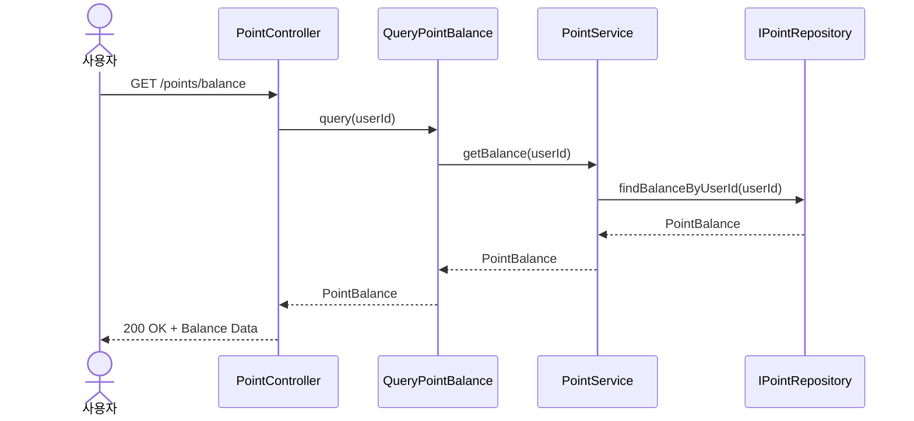
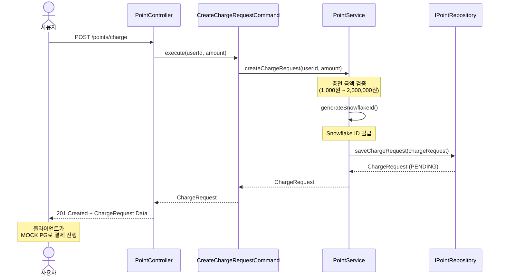
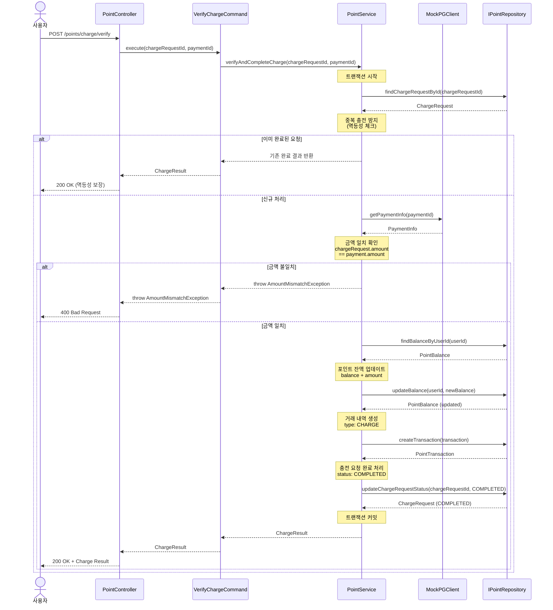

# 포인트 시퀀스 다이어그램

## 1. 포인트 잔액 조회 (GET /points/balance)

## 2. 포인트 충전 요청 생성 (POST /points/charge)

## 3. 포인트 충전 검증 및 완료 (POST /points/charge/verify)

## 주요 특징

### 레이어 구조
- **Controller (Presentation)**: HTTP 요청/응답 처리, Domain → DTO 변환
- **UseCase (Application)**: 비즈니스 플로우 조율, 트랜잭션 경계
- **DomainService (Domain)**: 도메인 로직, 비즈니스 규칙 검증, Snowflake ID 생성
- **Repository (Infrastructure)**: 데이터 영속성, Prisma ↔ Domain 변환

### 도메인 모델
- **PointBalance**: 사용자별 포인트 잔액
- **ChargeRequest**: 포인트 충전 요청 (Snowflake ID, 금액, 상태)
- **PointTransaction**: 포인트 거래 내역 (CHARGE, USE)

### 비즈니스 규칙

#### 충전 금액 검증
- 최소 충전 금액: 1,000원
- 최대 충전 금액: 2,000,000원
- 원 단위 (소수점 불가)

#### Snowflake ID
- 분산 환경에서 고유 ID 생성
- 충전 요청 식별자로 사용

#### 멱등성 보장
- 동일한 충전 요청 ID로 중복 검증 시
- 기존 완료 결과 반환 (재처리 방지)

#### PG 결제 검증
- MOCK PG API로 실제 결제 금액 조회
- 충전 요청 금액과 PG 결제 금액 일치 확인
- 불일치 시 400 Bad Request

#### 트랜잭션 처리
- 포인트 잔액 업데이트
- 거래 내역 생성
- 충전 요청 상태 변경
- 모두 원자적으로 처리 (All or Nothing)

### 에러 처리

- **충전 금액 범위 초과**: 400 Bad Request
- **존재하지 않는 충전 요청**: 404 Not Found
- **금액 불일치**: 400 Bad Request (AMOUNT_MISMATCH)
- **네트워크 오류**: PG 대사를 통한 수동 복구 필요
