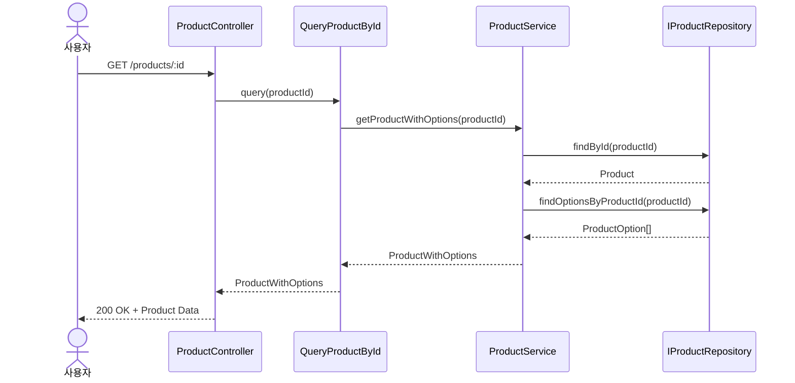
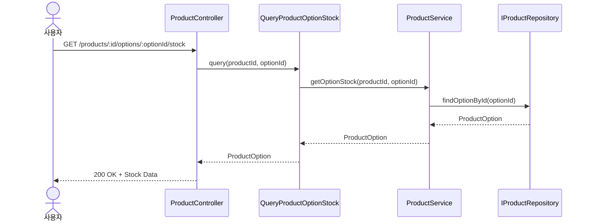
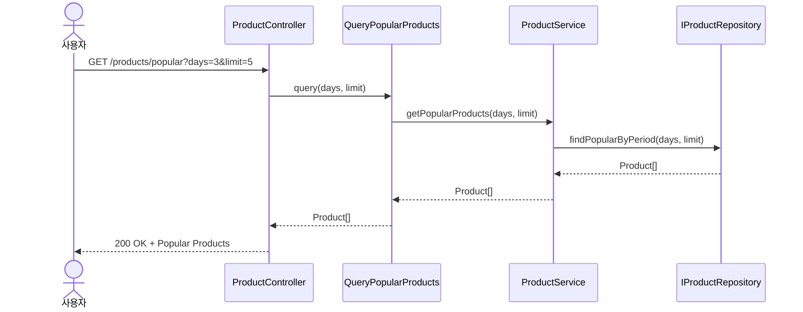

# 상품 정보 조회 시퀀스 다이어그램

## 1. 상품 정보 조회 (GET /products/:id)

## 2. 재고 실시간 확인 (GET /products/:id/options/:optionId/stock)

## 3. 인기 상품 조회 (GET /products/popular)

## 주요 특징

### 레이어 구조
- **Controller (Presentation)**: HTTP 요청/응답 처리, Domain → DTO 변환
- **UseCase (Application)**: 비즈니스 플로우 조율, 트랜잭션 경계
- **DomainService (Domain)**: 도메인 로직, 엔티티 조합
- **Repository (Infrastructure)**: 데이터 영속성, Prisma ↔ Domain 변환

### 도메인 모델
- **Product**: 상품 기본 정보
- **ProductOption**: 상품 옵션 (SKU 단위)
- **ProductWithOptions**: Product + ProductOption[] 조합 모델

### 에러 처리

- 존재하지 않는 상품/옵션: 404 Not Found
- 잘못된 요청 파라미터: 400 Bad Request
- DB/Cache 연결 오류: 500 Internal Server Error
